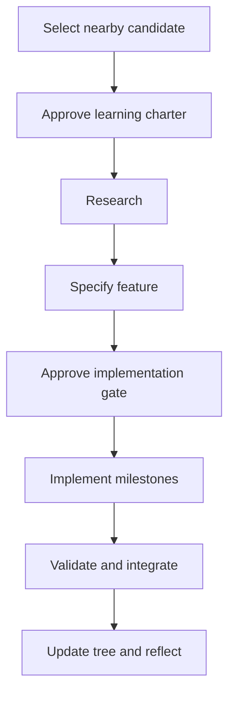

# Development Protocol

## 1. Purpose

This document defines the reusable lifecycle for selecting, researching, specifying, implementing, validating and integrating every tech-tree node. It also defines how architecture, stack and model migrations are performed without unnecessary breakage.

The protocol applies to V0 and every subsequent node.

## 2. Lifecycle overview



A candidate is not a commitment. Implementation begins only after its learning charter, research synthesis and feature context have been reviewed.

## 3. Stage A — Node selection and learning charter

Create or update `docs/nodes/<node>/NODE_CONTEXT.md` with:

- unique node ID after selection;
- title and affected realms;
- prerequisites and evidence that they are satisfied;
- learning questions;
- current-system limitation;
- intended new capability;
- north-star vector;
- scope and non-goals;
- expected demonstration;
- expected validation strategy;
- important unknowns requiring research.

### Gate A

A human approves the learning questions and boundaries. No research or architecture plan should compensate for an unclear learning objective.

## 4. Stage B — Research

Generate `RESEARCH_PROMPT.md` from the approved charter. Research should prioritize:

1. standards and official documentation;
2. peer-reviewed papers and established textbooks;
3. official open-source project documentation and source code;
4. vendor documentation where it defines real equipment behaviour;
5. secondary explanations only for orientation.

`RESEARCH_REPORT.md` must distinguish cited fact, engineering choice, assumption and inference. It should cover:

- prerequisite concepts;
- real-world architecture and behaviour;
- suitable simplified educational implementation;
- equations, state machines, units and sign conventions;
- validity domain and omitted phenomena;
- interface and data requirements;
- open-source tool candidates and replacement boundaries;
- validation references, cases and tolerances;
- failure modes and common implementation errors;
- licensing or interoperability concerns;
- unresolved decisions.

Research is evidence for a design decision, not the design specification itself.

### Gate B

The report provides enough evidence to select an honest model boundary and validation method. Unsupported realism claims are removed or explicitly labelled experimental.

## 5. Stage C — Feature architecture

The architect reads the constitution, north star, development protocol, live tree, current architecture, node charter and research report. It then creates `FEATURE_CONTEXT.md` without implementing code.

The feature context must define:

- Git branch name;
- learning outcomes;
- current architecture affected;
- scope and non-goals;
- selected model boundary and cited basis;
- schemas, ports and dependency direction;
- time and event semantics;
- compatibility and migration requirements;
- sequential milestones and test gates;
- reference scenario;
- node-specific Definition of Done;
- documentation updates;
- known risks and rollback strategy.

### Gate C

A human approves the model boundary, architecture, milestones, demonstration and Definition of Done. Only then may the Git feature branch be created.

## 6. Stage D — Milestone implementation

Development rules:

1. Never commit directly to `main`.
2. Execute milestones sequentially.
3. Do not begin milestone N+1 until milestone N tests pass.
4. Keep the deterministic simulation core separate from asynchronous I/O.
5. Use canonical typed contracts at component boundaries.
6. Do not expand scope to an unapproved tech-tree candidate.
7. Record status, test evidence, decisions and deviations in `PROGRESS.md`.
8. Stop when evidence contradicts the selected model or architecture; return to the appropriate gate.

Implementation commits should remain small enough to review and, where practical, separate behaviour-preserving preparation from behaviour-changing work.

## 7. Stage E — Validation

`VALIDATION_REPORT.md` must answer the original learning questions and include:

- automated test results;
- reference comparisons and numerical tolerances;
- deterministic replay results;
- operational demonstration evidence;
- traceability from claim to source, implementation and test;
- known deviations and limitations;
- regression results;
- performance evidence when relevant;
- unsupported claims explicitly rejected.

### Universal test layers

- unit tests for local behaviour;
- contract tests for interchangeable implementations;
- integration tests across component boundaries;
- golden scenarios for durable external behaviour;
- invariant tests for physical and operational truths;
- differential tests when replacing a model, solver or stack component.

### Gate D

The node-specific and universal Definitions of Done pass. A reviewer confirms that evidence supports the claimed maturity.

## 8. Stage F — Integration, tree update and reflection

After validation:

1. Update `ARCHITECTURE.md` to describe the implemented system.
2. Add or update sources in `REFERENCES.md`.
3. Add the completed capability to `TECH_TREE.md` with evidence.
4. Reassess maturity in each affected realm.
5. Propose at most one to three nearby candidates per relevant realm.
6. Remove or revise obsolete proposals.
7. Update `CHANGELOG.md`.
8. Complete `RETROSPECTIVE.md`.

Candidates proposed at this stage do not receive permanent IDs or implementation milestones until selected.

## 9. Universal Definition of Done

A node is complete only when:

- approved milestones and node-specific tests pass;
- existing regression scenarios pass or have an approved versioned migration;
- deterministic behaviour is preserved where required;
- new boundaries use canonical contracts;
- units, signs, quality and time semantics are explicit;
- model assumptions and validity limits are documented;
- claims are traceable to references and evidence;
- a repeatable demonstration exists;
- known limitations and nonclaims are explicit;
- architecture, references, changelog and tech-tree state are updated;
- a retrospective records what was learned.

## 10. Evolution and migration protocol

### 10.1 Change classes

| Class | Meaning |
|---|---|
| Refactor | Internal structure changes; observable behaviour and contracts remain unchanged |
| Compatible extension | Capability is added without breaking supported consumers |
| Contract migration | Schema, API or semantics intentionally change |
| Stack replacement | A solver, framework, database, transport or library is replaced |
| Model upgrade | Physical or control behaviour intentionally changes because fidelity improves |

Do not label intentional behavioural change as refactoring.

### 10.2 Migration stages

1. **Characterize:** capture tests, fixtures, golden scenarios, performance and undocumented behaviour.
2. **Isolate:** introduce a stable port or adapter around the current implementation without changing behaviour.
3. **Implement:** add the replacement behind the same boundary.
4. **Compare:** run old and new implementations against identical inputs where possible.
5. **Classify differences:** expected improvement, acceptable deviation, compatibility failure, hidden bug or unresolved result.
6. **Switch reversibly:** select implementations through configuration or a controlled feature flag.
7. **Migrate persisted data:** use versioned, tested converters.
8. **Deprecate:** retain the old implementation until the replacement passes integrated release criteria.
9. **Remove deliberately:** document removal and eliminate compatibility code only after its support window ends.

### 10.3 Required migration specification

Significant changes add the following to `FEATURE_CONTEXT.md` or an ADR:

```yaml
change_class:
motivation:
blocked_capability:
stable_boundaries:
contracts_changed:
compatibility_policy:
characterization_tests:
parallel_run_strategy:
acceptance_tolerances:
persistent_data_migration:
rollback_plan:
deprecation_period:
```

### 10.4 Compatibility rules

Anything crossing a process boundary or surviving between executions is versioned, including scenarios, messages, APIs, event logs, historian records, snapshots and exported results.

- Prefer additive optional fields over renaming.
- Never reuse a field with a new meaning.
- Never change units or sign conventions silently.
- Write the newest supported format.
- Read older supported formats through explicit migrations.
- Reject incompatible versions clearly.
- Include schema and model versions in snapshots and evidence.

Model maturation should normally add a new fidelity implementation rather than overwrite the only existing model. Simplified models may remain valuable for teaching, testing and fast execution.

## 11. Architecture Decision Records

Create an ADR when a decision:

- changes a constitutional invariant;
- introduces or replaces a major framework, solver or database;
- changes a canonical contract;
- changes time, event-ordering or snapshot semantics;
- establishes a long-lived dependency direction;
- rejects a consequential alternative likely to be reconsidered.

ADRs record context, alternatives, decision, consequences, migration and conditions for reconsideration.
