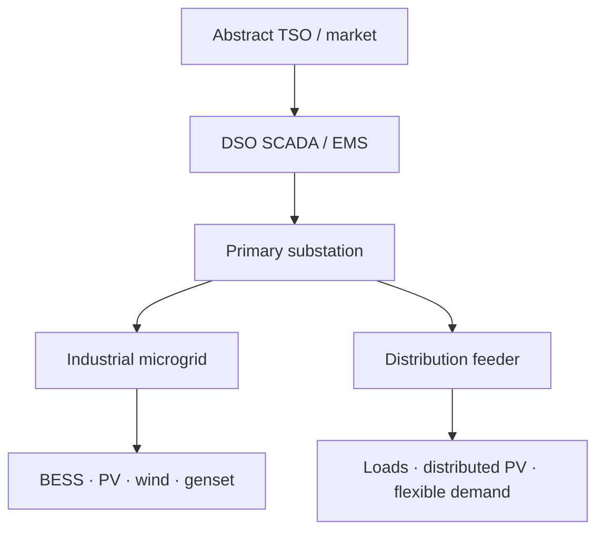

# North Star: Final-Boss Reference System

## Status

Version: 0.1 — initial architectural hypothesis

This document provides a direction of travel. It freezes neither the exact route nor the final libraries, models, deployment topology or numerical methods. It should be reviewed after major validated slices, not casually rewritten to match whichever implementation was easiest.

## 1. Reference-system definition

The final-boss system is an open-source, software-based laboratory representing a small but operationally realistic electrical distribution system. It includes substations, feeders, controllable loads, distributed generation, storage, local automation, protection functions, industrial communications, supervisory control, a historian and security boundaries.

Physical models may remain reduced-order where appropriate. Operational workflows, interfaces, state ownership, command validation, alarms, events, communication behaviour and failure handling should progressively resemble real systems.

## 2. Reference topology

The mature reference system may contain:

- one abstract transmission-grid or market interface;
- one DSO supervisory layer;
- one primary substation and representative secondary substations;
- two or more feeders;
- one island-capable industrial microgrid;
- BESS, PV, wind, genset, static loads and controllable loads;
- transformers, lines, breakers and representative protection;
- local controllers, plant controllers, RTUs and gateways;
- SCADA, historian, alarm management and engineering views;
- simulated operational-network segmentation.

These elements are a reference envelope, not a commitment to implement them in this order.

## 3. Representative final-boss scenario

A mature integrated demonstration should be capable of the following operational sequence:

1. Start in normal grid-connected operation.
2. Load forecasts, generation forecasts and operating schedules.
3. Dispatch storage and flexible generation.
4. Respond to varying load and renewable production.
5. Experience a feeder fault or equivalent disturbance.
6. Operate protection and isolate the affected section.
7. Island the industrial microgrid where conditions permit.
8. Establish or maintain the island using grid-forming resources.
9. Start and synchronize a genset if required.
10. Shed noncritical load when available generation is insufficient.
11. Restore supply in controlled stages.
12. Resynchronize and reconnect to the utility.
13. Present alarms, acknowledgements and sequence-of-events records.
14. Replay the event through historian and snapshot evidence.
15. Optionally repeat the scenario with a communication or cybersecurity disturbance.

## 4. Realism dimensions

| Dimension | North-star intent | Explicit boundary |
|---|---|---|
| Electrical physics | Validated RMS/quasi-static models plus selected dynamics | Not universal EMT or switching-waveform simulation |
| Control | Hierarchical modes, limits, interlocks, dispatch and restoration | Not production safety logic |
| Protection | Representative relay and breaker behaviour with selected coordination studies | Not certified settings engineering |
| Communications | Actual open-source protocol implementations where useful, including timing and failures | Not a claim of vendor or utility conformance without evidence |
| Operations | Realistic SCADA command, alarm, acknowledgement, isolation and restoration workflows | Not a full control-centre product |
| Data | Quality, timestamps, sequence of events, historian, replay and traceability | Not an unlimited utility data platform |
| Cybersecurity | Identity, permissions, segmentation, audit and controlled attack scenarios | Not blanket IEC 62443 compliance |
| Scale | A representative multi-feeder system | Not national-grid scale |
| Compliance | Selected executable requirements tied to exact references | Not general certification |

## 5. Model-replacement direction

The architecture should allow maturation such as:

| Early implementation | Possible maturation direction |
|---|---|
| Ideal bounded source | Energy balance → dynamic response → validated device model |
| Fixed-voltage grid | Network equivalent → power flow → selected electromechanical dynamics |
| Static load | Profile → voltage/frequency dependence → composite dynamic model |
| Ideal inverter | Lag and limits → droop → GFL/GFM control dynamics |
| Boolean breaker | State machine → interlocks → protection-driven operation |
| In-memory message | Delay/loss model → external adapter → network-emulated deployment |
| Synthetic viewer | Operational HMI → alarm workflow → engineering and control-centre views |
| Threshold trip | Time characteristic → coordination → validated representative relay behaviour |

Not every early model must be deleted. Several levels of abstraction may remain useful for teaching, performance and comparison.

## 6. Revision policy

A north-star revision should state:

- what new evidence or learning motivates the change;
- which reference capabilities or boundaries change;
- whether existing tech-tree proposals become obsolete;
- which Architecture Decision Record contains the rationale.

Review is recommended after two or three substantial integrated slices or when the reference system blocks learning rather than guiding it.
